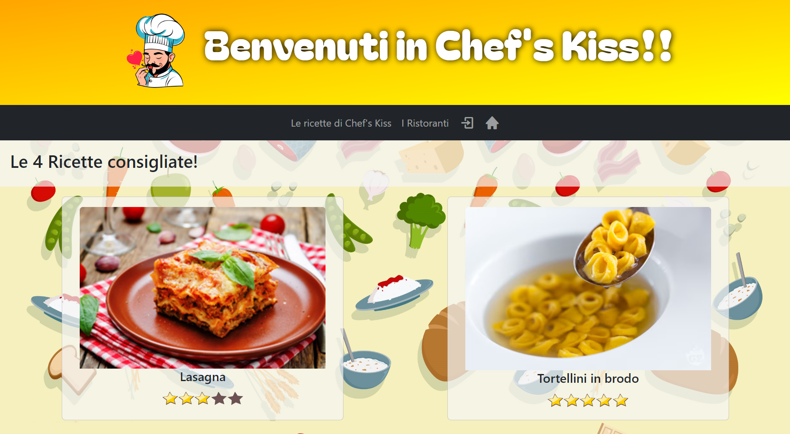
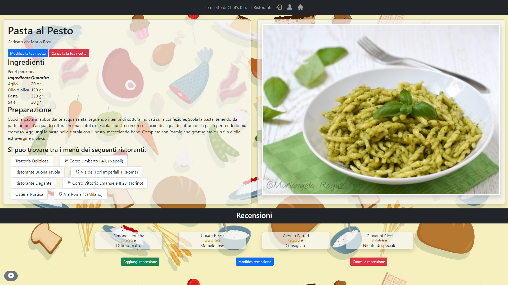

# *CHEF'S KISS WEBAPP*

Questo progetto è una piattaforma web dedicata agli appassionati di cucina e ristorazione.

La piattaforma mira a fornire un sistema completo per la gestione delle recensioni, la condivisione di ricette culinarie e la gestione delle prenotazioni presso i ristoranti, con l'ausilio di un database che traccia piatti, utenti, ristoranti, sedi e relative prenotazioni.

Gli utenti possono accedere o registrarsi al sistema selezionando uno o più ruoli, ciascuno dei quali offre funzionalità specifiche:

- **Privato**: Gli utenti privati possono registrare uno username (visualizzato nei post delle ricette) e una foto profilo. Possono pubblicare ricette e valutare quelle postate da altri utenti.

- **Cliente**: Dopo aver pubblicato un certo numero di recensioni, i clienti possono essere elevati al rango di "recensore affidabile". I clienti verificati possono recensire i ristoranti che hanno visitato, prenotare tavoli presso le sedi dei ristoranti, modificare o annullare le prenotazioni.

- **Chef**: Gli chef possono registrare una foto profilo e un curriculum delle loro attività nel settore della ristorazione. Possono proporre piatti e eventualmente servirli in una o più sedi di un ristorante in cui lavorano.

- **Ristoratore**: I ristoratori possono registrare e gestire uno o più ristoranti. Se il ristorante fa parte di una catena, possono gestire tutte le sedi associate, visualizzare le informazioni e gestire il personale, inclusi gli chef.
  

Inoltre tutti gli utenti, compresi quelli non registrati, possono ricercare ricette per nome, valutazioni medie, ingredienti e allergeni e ricercare ristoranti e le loro sedi, visualizzare i rispettivi menu, e filtrare i risultati in base a valutazioni o città.

